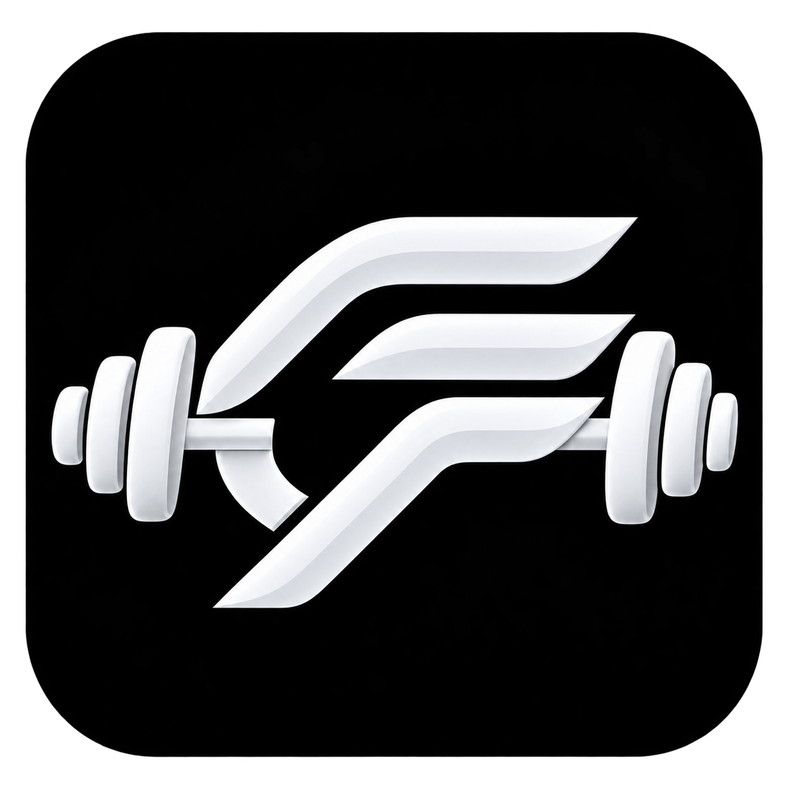
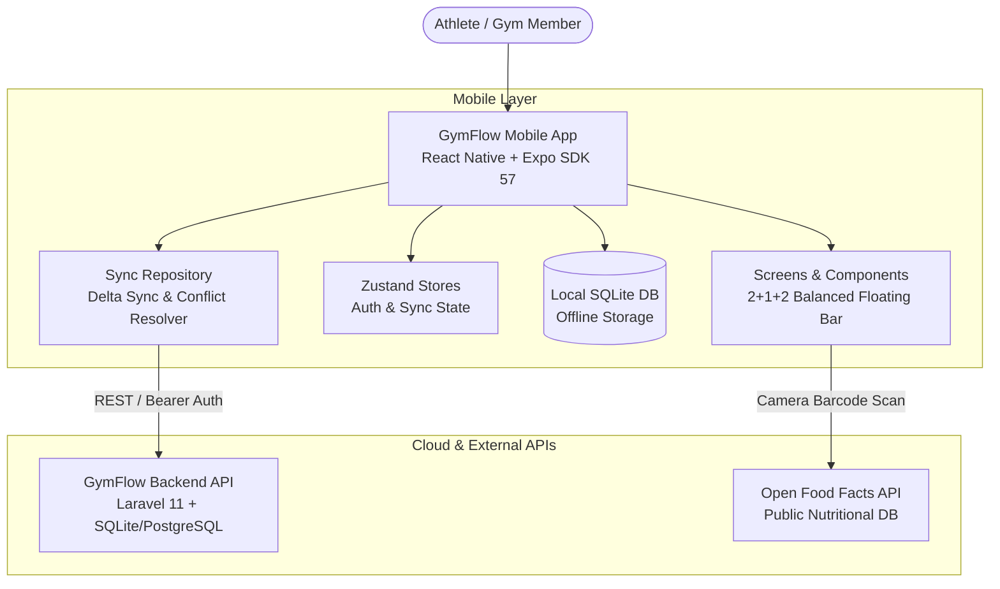

<div align="center">

  

  # GymFlow

  **Next-Generation Offline-First Member-Facing Fitness Companion**

  [](https://reactnative.dev/)
  [](https://expo.dev/)
  [](https://www.typescriptlang.org/)
  [](https://laravel.com/)
  [](https://www.sqlite.org/)
  [](https://jestjs.io/)

  <p align="center">
    Built for athletic performance, seamless gym floor execution, and zero-latency logging.<br />
    Designed with a surgical dark mode aesthetic, electric-lime precision highlights, and local-first SQLite persistence.
  </p>

</div>

---

## 📖 Table of Contents

- [Overview & Philosophy](#-overview--philosophy)
- [Key Features](#-key-features)
- [App Architecture](#-app-architecture)
- [Repository Structure](#-repository-structure)
- [Getting Started](#-getting-started)
  - [Prerequisites](#prerequisites)
  - [1. Mobile Application Setup](#1-mobile-application-setup)
  - [2. Backend API Setup](#2-backend-api-setup)
  - [3. Running on Devices](#3-running-on-devices)
- [Available Scripts](#-available-scripts)
- [Testing & Quality Assurance](#-testing--quality-assurance)
- [Design System & UI Tokens](#-design-system--ui-tokens)
- [Sync Engine & Data Contract](#-sync-engine--data-contract)
- [Authors & Team](#-authors--team)

---

## ⚡ Overview & Philosophy

**GymFlow** is an enterprise-grade member companion mobile application designed for premium fitness clubs, boutique training studios, and individual athletes.

Traditional fitness apps fail on the gym floor due to spotty basement Wi-Fi, dead zones, and sluggish network roundtrips. GymFlow solves this fundamentally:

* **Offline-First Resilience:** Every workout set, meal log, hydration entry, and check-in writes immediately to an embedded SQLite database.
* **Intelligent Background Sync:** Changes sync transparently to the Laravel cloud API when connectivity is detected, with automatic conflict resolution (HTTP 409 handling).
* **Ergonomic 2+1+2 Floating Navigation Bar:** Eliminates crowded tab bars by placing quick daily destinations on the sides and high-frequency creation tools in an elevated center **Action Hub (`+`)**.
* **High-Contrast Design System:** Optimized for high-glare gym environments with deep charcoal surfaces (`#0F0F10`), surgical electric-lime accents (`#CCFF00`), and bold athletic typography.

---

## ✨ Key Features

### 1. 📅 Interactive Week Schedule on Home
* **7-Day Dynamic Week Strip:** View booked sessions across the week directly on the dashboard.
* **Session Dots & Status:** Indicator dots highlight days with active classes or PT reservations.
* **One-Tap Check-In:** Members can instantly check into today's class from the home screen.
* **Full Calendar Transition:** Seamlessly opens the complete multi-week calendar and booking manager.

### 2. 🥗 Barcode Food Scanner & Macro Tracker
* **Real-Time Camera Scanner:** Powered by `expo-camera` with instant barcode recognition.
* **Open Food Facts API Integration:** Instant nutritional lookup for millions of packaged products with zero API key dependencies.
* **Daily Macro Breakdown:** Automatic calculations of Calories, Protein, Carbohydrates, and Fats against the member's daily targets.

### 3. 🏋️ Workout Catalog & 300+ Exercise Animations
* **Extensive Exercise Database:** 300+ exercise routines categorized by muscle group, target difficulty, and equipment.
* **High-Definition Guides:** Synced asset animations demonstrating optimal biomechanics and form cues.
* **Interactive Rep & Set Logger:** Real-time rest timers, set tracking, and weight progression.

### 4. 💧 Smart Hydration Tracking
* **Dynamic Daily Goal:** Calculated using bodyweight and daily exercise intensity formulas.
* **Quick Log Increments:** Log water intake with 250ml, 500ml, or custom volume increments with haptic feedback.

### 5. 🤖 AI Coach & Smart Assistant
* Contextual workout recommendations, recovery guidance, and personalized nutrition planning tailored to member history and preferences.

### 6. 🛡️ Account & Membership Protection
* Forced password reset guardrails on first login.
* Token renewal and secure credential persistence via `expo-secure-store`.

---

## 🏗️ App Architecture



---

## 📁 Repository Structure

```
GymFlow/
├── assets/
│   ├── brand/               # Brand vectors, new squircle logo, wordmark, and banner
│   └── screenshots/         # App showcase screenshots for documentation
├── backend/                 # Laravel 11 REST API
│   ├── app/                 # Controllers, Models, Middleware, Services
│   ├── database/            # Migrations, seeders, SQLite schemas
│   ├── routes/              # api.php endpoint definitions
│   └── tests/               # PHPUnit feature and unit tests
├── mobile/                  # React Native + Expo Mobile Application
│   ├── assets/              # App icons, splash screens, workout animations
│   ├── scripts/             # Asset synchronization & postinstall automation
│   ├── src/
│   │   ├── api/             # Axios HTTP client & interceptors
│   │   ├── components/      # GymTabBar, GymFlowBrand, ActionSheets, Skeletons
│   │   ├── db/              # SQLite database schema, migrations, connection
│   │   ├── navigation/      # RootNavigator, Stack/Tab definitions & TypeScript types
│   │   ├── screens/         # Dashboard, Catalog, Schedule, Progress, Profile, Scanners
│   │   ├── store/           # Zustand stores (Auth, Sync, Preferences)
│   │   ├── sync/            # Sync engine, delta synchronizer, workout catalog merge
│   │   ├── theme/           # Color palette, athletic typography, spacing, border radii
│   │   └── types/           # Domain contracts, session models, API payloads
│   ├── App.tsx              # Application entry point with providers
│   ├── app.json             # Expo configuration, plugins (camera, secure store, sqlite)
│   └── package.json         # Dependencies and scripts
├── tests/                   # Monorepo End-to-End test suites (Detox / integration)
├── CONTRACT.md              # Cross-platform data contract and API specifications
├── PROJECT.md               # Architecture documentation & design system rules
└── README.md                # Project documentation and developer guide
```

---

## 🚀 Getting Started

Follow these steps to set up and run the GymFlow project locally on your machine.

### Prerequisites

Ensure you have the following installed:
* **Node.js**: `v18.x` or `v20.x` ([Download Node.js](https://nodejs.org/))
* **npm**: `v9.x` or later
* **PHP**: `v8.2` or later (for the Laravel backend)
* **Composer**: `v2.x` ([Download Composer](https://getcomposer.org/))
* **Expo Go** app on your physical iOS or Android phone, or Android Studio / Xcode for emulators.

---

### 1. Mobile Application Setup

1. **Navigate to the mobile directory:**
   ```bash
   cd mobile
   ```

2. **Install dependencies:**
   ```bash
   npm install --legacy-peer-deps
   ```
   *(Note: The postinstall script automatically prepares workout guide assets and typings).*

3. **Verify TypeScript compilation:**
   ```bash
   npm run typecheck
   ```

4. **Run tests:**
   ```bash
   npm test
   ```

5. **Start the Expo Metro Bundler:**
   ```bash
   npx expo start -c
   ```

---

### 2. Backend API Setup

1. **Navigate to the backend directory:**
   ```bash
   cd backend
   ```

2. **Install PHP dependencies:**
   ```bash
   composer install
   ```

3. **Set up the environment:**
   ```bash
   cp .env.example .env
   php artisan key:generate
   ```

4. **Run migrations and seed the database:**
   ```bash
   php artisan migrate --seed
   ```

5. **Start the API server:**
   ```bash
   php artisan serve --host=0.0.0.0 --port=8000
   ```

---

### 3. Running on Devices

* **Physical Device (Expo Go):**
  1. Make sure your phone and development computer are on the same Wi-Fi network.
  2. In `mobile/app.json`, update `extra.apiBaseUrl` with your machine's LAN IP address (e.g. `http://192.168.1.X:8000`).
  3. Scan the QR code shown in the terminal with the **Camera app (iOS)** or **Expo Go (Android)**.
* **Android Emulator:** Press `a` in the terminal running Expo.
* **iOS Simulator:** Press `i` in the terminal running Expo.
* **Web Preview:** Press `w` to open in browser.

---

## 📜 Available Scripts

### Mobile (`cd mobile`)

| Command | Description |
| :--- | :--- |
| `npm start` | Launches Expo Metro bundler |
| `npm run typecheck` | Validates TypeScript with no emit (`tsc --noEmit`) |
| `npm test` | Executes Jest test runner across all test suites |
| `npm run test:watch` | Runs Jest in interactive watch mode |
| `npm run lint` | Runs ESLint analysis across the mobile codebase |
| `npm run sync:assets`| Re-generates workout guide asset mappings |

### Backend (`cd backend`)

| Command | Description |
| :--- | :--- |
| `php artisan serve` | Starts the local API development server |
| `php artisan test` | Runs the PHPUnit backend test suite |
| `php artisan migrate:fresh --seed` | Resets database with fresh demo data |

---

## 🧪 Testing & Quality Assurance

The GymFlow project adheres to strict quality standards:
* **TypeScript:** Strict type checking enabled (`strict: true`). Zero implicit `any`.
* **Unit & Component Testing:** Comprehensive Jest test suites covering authentication, brand components, workout catalog filters, offline storage, and data synchronization.
* **Test Results:** 12 test suites passing, 133 individual tests executed.
* **E2E Testing:** Configured with Detox for automated native user journeys.

Run the test suite anytime:
```bash
cd mobile
npm test
```

---

## 🎨 Design System & UI Tokens

GymFlow enforces a design system tailored for high-energy fitness applications:

| Token Name | Value | Purpose |
| :--- | :--- | :--- |
| **Background** | `#0F0F10` | Deep midnight dark canvas |
| **Surface** | `#1C1C1E` | Primary elevated card surface |
| **Surface Elevated** | `#2C2C2E` | Secondary elevated surface & chips |
| **Primary Accent** | `#CCFF00` | Electric lime high-contrast interactive highlight |
| **Text Primary** | `#FFFFFF` | Clear readable header typography |
| **Text Secondary** | `#8E8E93` | Supporting metadata and labels |
| **Error / Alert** | `#FF453A` | System warnings and rejection notifications |

---

## 🔄 Sync Engine & Data Contract

GymFlow utilizes a robust client-server synchronizer documented in [`CONTRACT.md`](CONTRACT.md):
* **Idempotency Keys:** Every mutation carries a deterministic UUID ensuring network retries never duplicate sets or bookings.
* **Optimistic Local Execution:** UI updates immediately; offline sync tasks are queued in SQLite table `sync_queue`.
* **Conflict Resolution:** In the event of a `409 Conflict`, the active banner displays conflict context to the user while keeping local state consistent.

---

## 👥 Authors & Team

Developed with precision for **GymFlow**:
* **Lead Architect & Developer:** [Janver P. Manlapaz](https://github.com/janveryuu)
* **Repository:** [janveryuu/GymFlow](https://github.com/janveryuu/GymFlow)
* **Organization:** GymFlow Engineering Team

---

<div align="center">
  <sub>Built for Peak Performance • GymFlow Mobile v0.1.0</sub>
</div>
